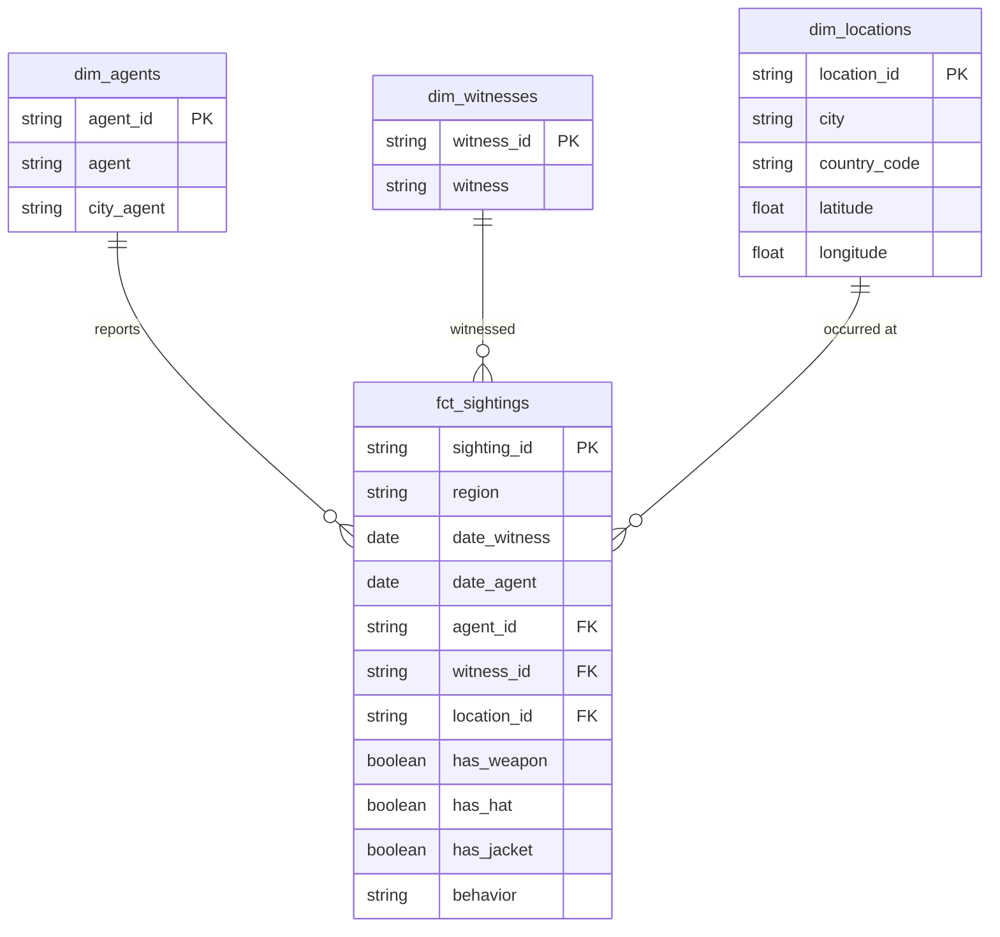
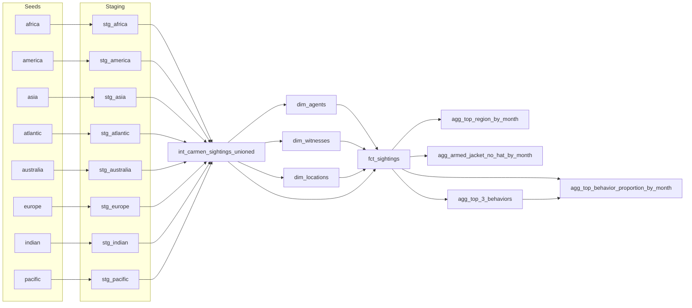

<div align="center">

# 🕵️ Where in the World is Carmen Sandiego?
### dbt Analytics Engineer Assessment

*Interpol's field reports, engineered into an analytics-ready model.*


**Author:** Soham Arya

</div>


## 📌 TL;DR

Interpol's 8 regional HQs each filed sighting reports for Carmen Sandiego in their own spreadsheets. This project:

1. Ingests all 8 regional CSVs as dbt seeds
2. Standardises and types them through one shared macro (8 staging models, zero copy-paste SQL)
3. Unions and normalizes them into a proper star-schema-style fact/dimension model
4. Answers 4 analytical questions Interpol actually cares about, as queryable views


## 🗺️ Project structure

```
wheres_carmen/
├── seeds/carmen_sightings/       # 8 raw regional CSVs (source of truth)
├── models/
│   ├── staging/                  # 1 view per region, typed & cleaned
│   ├── intermediate/             # unioned 1NF sighting log
│   └── marts/
│       ├── core/                 # normalized star schema (facts + dims)
│       └── analytics/            # 4 views answering the assessment questions
├── macros/
│   └── stage_carmen_sighting.sql # shared staging logic, called 8x
├── sample_profiles.yml           # Snowflake connection template
├── packages.yml                  # dbt_utils dependency
└── dbt_project.yml
```


## 🛠️ Tooling

| | |
|---|---|
| **Warehouse** | Snowflake (free 2-week trial) |
| **Transformation** | dbt Core |
| **Package** | [dbt_utils](https://github.com/dbt-labs/dbt-utils) for surrogate keys |


## 🧭 The approach

### Step 1: Extract
Already done for us: the assessment provides 8 regional CSVs pre-conformed to the shared data dictionary. Loaded as-is via `dbt seed`.

### Step 2: Stage (one view per region)
Each region gets its own staging model, but rather than writing the same casting/cleanup logic 8 times, all of it lives in one macro:

```sql
{{ stage_carmen_sighting(source_relation=ref('carmen_sightings__africa'), region_name='Africa') }}
```

The macro:
- Casts dates, floats, and booleans to proper types
- Trims and normalizes string casing
- Tags every row with its source `region`
- Generates a stable surrogate key (`sighting_id`), since the raw data has no natural primary key

One change to the macro updates all 8 regions at once.

### Step 3: Union + normalize beyond 1NF
`int_carmen_sightings_unioned` stacks all 8 staging views into a single flat (still 1NF) log. From there, the **core** layer splits it into a proper normalized schema:

| Model | Grain |
|---|---|
| `dim_agents` | one row per (agent, HQ city) |
| `dim_witnesses` | one row per witness |
| `dim_locations` | one row per (city, country, lat/long) |
| `fct_sightings` | one row per sighting, FK'd to all three dimensions |

This pulls the repeating agent/location attribute groups out of the fact table, landing at 3NF for the purposes of this exercise.

#### Entity-Relationship Diagram



#### dbt DAG




## 📊 Analytics answers

All four live as views in `models/marts/analytics/`, built on `fct_sightings`.

| Question | Model | Logic |
|---|---|---|
| **(a)** Top region per calendar month | `agg_top_region_by_month` | Groups by month + region, ranks regions within each month, keeps rank 1 |
| **(b)** % armed + jacket + no hat, per month | `agg_armed_jacket_no_hat_by_month` | `has_weapon AND has_jacket AND NOT has_hat`, divided by total sightings that month |
| **(c)** Top 3 behaviors overall | `agg_top_3_behaviors` | Counts each `behavior` value, keeps top 3 |
| **(d)** % of top-3 behaviors, per month | `agg_top_behavior_proportion_by_month` | References `agg_top_3_behaviors` directly (no hardcoded strings), computes proportion per month |

> 📝 **After running this against Snowflake:** query `select * from agg_armed_jacket_no_hat_by_month order by sighting_month;` and drop your actual observation here (seasonality, a region driving the trend, etc.)


## ⚠️ Known limitations

- `dim_witnesses` is keyed on name alone. Two different people sharing a name would collapse to one row; the source data gives nothing else to disambiguate them.
- `sighting_id` is a generated surrogate key (hash of witness/agent/date/location). Fully identical sightings across all of those fields would collapse to one row; not observed in spot-checks, but a theoretical edge case.
- Test coverage covers `not_null` / `unique` / `relationships` on primary/foreign keys. No custom singular tests for domain rules (e.g. valid ISO country codes) given the scope of this exercise.


## ▶️ How to run

```bash
dbt deps                              # install dbt_utils
dbt seed                              # load the 8 regional CSVs
dbt run                               # build staging → intermediate → core → analytics
dbt test                              # not_null / unique / relationships tests
dbt docs generate && dbt docs serve   # optional: browsable lineage graph
```

Connection setup: copy `sample_profiles.yml` into `~/.dbt/profiles.yml` (kept out of the repo since it holds credentials) and fill in your Snowflake account locator, user, and password from the setup script in the assessment brief.
