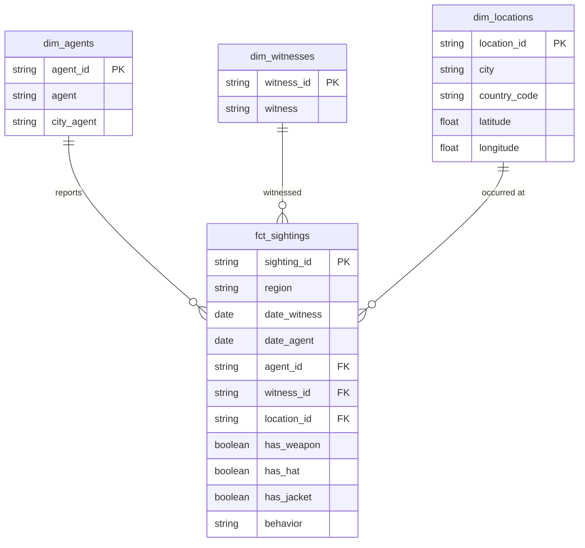
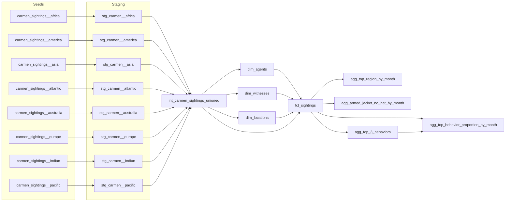

# Where in the World is Carmen Sandiego? — dbt Analytics Engineer Assessment

Soham Arya

## Database / tooling

- **Warehouse:** Snowflake (free trial), using the setup script provided in the assessment brief.
- **dbt:** dbt Core, run locally against Snowflake.

## Approach

### Step 1: Extract

Not required for this submission, the assessment already provides the 8 regional CSVs pre-conformed to the shared data dictionary (`carmen_sightings__<region>.csv`). These are loaded as dbt seeds under `seeds/carmen_sightings/`.

### Step 2: Staging (one view per region)

Each of the 8 regions gets its own staging model (`models/staging/stg_carmen__<region>.sql`). Rather than repeat the same casting/cleanup logic 8 times, I wrote a single macro, `stage_carmen_sighting()` (`macros/stage_carmen_sighting.sql`), that:

- casts dates, floats, and booleans to their proper types
- trims and normalizes string casing on text fields
- tags each row with its source `region`
- generates a stable surrogate key (`sighting_id`) per row, since the source data has no natural primary key

Each staging model is then a one-line call to the macro with that region's seed and region name, e.g.:

```sql
{{ stage_carmen_sighting(source_relation=ref('carmen_sightings__africa'), region_name='Africa') }}
```

This keeps the 8 sources DRY and means any future change to the cleanup logic only needs to happen once.

### Step 3: Union + normalize beyond 1NF

`models/intermediate/int_carmen_sightings_unioned.sql` unions the 8 staging views into a single flat (still 1NF) sighting log.

From there, `models/marts/core/` normalizes this into a star-schema-ish design:

- **`dim_agents`** — one row per (agent, city_agent), removing the agent/HQ repeating group from the fact table
- **`dim_witnesses`** — one row per distinct witness
- **`dim_locations`** — one row per distinct (city, country_code, latitude, longitude), since these four fields are functionally dependent on each other in this dataset
- **`fct_sightings`** — one row per sighting, foreign-keyed to the three dimensions above, carrying only the sighting-specific facts (dates, has_weapon/has_hat/has_jacket, behavior, region)

This removes the repeating agent/location attribute groups from the fact table and gets the schema to 3NF for the practical purposes of this exercise. It isn't a full Kimball-grade conformed model (e.g. `dim_witnesses` has no attribute beyond name to disambiguate two people who happen to share a name), which is called out below as a known limitation rather than glossed over.

#### ERD



#### dbt DAG (layer view)



## Analytics answers

All four questions are answered by views in `models/marts/analytics/`, built on top of `fct_sightings`:

**(a) `agg_top_region_by_month`** — groups sightings by calendar month (month number, all years pooled) and region, then ranks regions within each month by sighting count, keeping the top one.

**(b) `agg_armed_jacket_no_hat_by_month`** — for each calendar month, computes the proportion of sightings where `has_weapon = true AND has_jacket = true AND has_hat = false`.

**(c) `agg_top_3_behaviors`** — counts occurrences of each distinct `behavior` value across the full fact table and keeps the top 3.

**(d) `agg_top_behavior_proportion_by_month`** — reuses `agg_top_3_behaviors` (rather than hardcoding the three behavior strings) to compute, per calendar month, the proportion of sightings whose behavior is one of those three.

> Once run against Snowflake, paste the actual query outputs / a short pattern observation for (b) here (e.g. seasonal spikes, any one region driving the trend) after running `select * from agg_armed_jacket_no_hat_by_month order by sighting_month;` and eyeballing the numbers.

## Known limitations / design tradeoffs

- `dim_witnesses` is keyed on name alone; the source data gives no other attribute to disambiguate two different people who share a name. Flagged rather than hidden.
- `sighting_id` is a generated surrogate key (hash of witness/agent/date/location fields) since the raw data has no natural primary key. In the rare case two sightings are fully identical across all of those fields, they'd collapse to one row; this dataset didn't show evidence of that at a spot-check but it's a theoretical edge case worth knowing about.
- Testing coverage (`not_null`, `unique`, `relationships`) is applied on primary/foreign keys in the core layer via `_core.yml`, but I did not build custom singular tests for domain-specific rules (e.g. valid country_code values) given the assessment's scope.

## How to run

```bash
dbt deps                # installs dbt_utils (used for surrogate keys)
dbt seed                # loads the 8 regional CSVs
dbt run                 # builds staging -> intermediate -> core -> analytics
dbt test                # runs not_null / unique / relationships tests
dbt docs generate && dbt docs serve   # optional, browsable lineage graph
```

`sample_profiles.yml` in the repo root shows the expected Snowflake connection shape; copy its contents into your local `~/.dbt/profiles.yml` (not committed, since it holds credentials) and fill in your account locator, user, and password from the setup script in the assessment brief.
